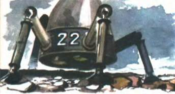
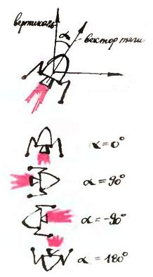
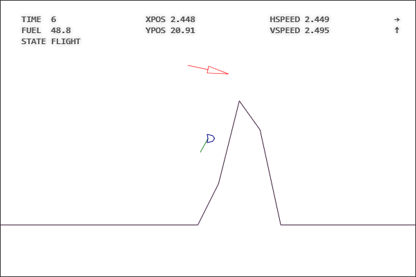

<meta charset="UTF-8">

## Вступление

Игровой demo-сервер доступен так же в интернете 24/7 в целях
ознакомления [http://codenjoy.com/codenjoy-contest](http://codenjoy.com/codenjoy-contest).

Игра с открытым исходным кодом. Для реализации своей игры, исправления
ошибок в текущей и внесения других правок необходимо для начала
[форкнуть проект](https://github.com/codenjoyme/codenjoy.git).
В корне репозитория есть описание в файле Readme.md - там описано, что делать дальше.

По возникающим вопросам, пиши в [skype alexander.baglay](skype:alexander.baglay)
или на почту [apofig@gmail.com](mailto:apofig@gmail.com).

Авторы этой игры вдохновлялись двумя примерами.
Во-первых, серией статей "Клуб электронных игр" в журнале "Техника-молодёжи", опубликованных в 1985 году.
И во-вторых, игрой "Lunar Lander", выпущенной компанией Atari в 1979 году в виде аркадного игрового автомата.

## В чем суть игры?

Вам нужно написать программу-бота, управляющую "лунолётом".
Лунолёт — это небольшое транспортные средство, предназначенное для перелётов вблизи поверхности Луны.

Игра разделена на уровни.
Задача каждого уровня — выполнить перелёт и совершить посадку на заданной площадке.

Перелёт выполняется передачей последовательности команд, по одной команде на каждом шаге.
Каждая команда описывает один манёвр и содержит три параметра:
* `угол` — наклон лунолёта от вертикальной оси, в градусах, отсчитывается по часовой стрелке,
  задаётся в диапазоне от `-180°` до `360°`:
  * `0°` означает направление тяги вверх
  * `180°` — вниз
  * `90°` — вправо
  * `-90°` либо `270°` — влево.
* `масса` — количество килограмм топлива, которые нужно сжечь за время манёвра.
* `время` — продолжительность манёвра в секундах, больше ноля.
Это означает, что лунолёт должен отклониться на заданный угол и в течение указанного времени
сжечь заданную массу топлива.

При взлёте нужно подать команду, в результате которой лунолёт преодолеет силу тяжести и оторвётся
от поверхности, иначе команда будет проигнорирована.
Сила тяжести на поверхности Луны равна `1.62 м/с^2`.

В случае, когда масса оставшегося топлива меньше, чем масса заданная для манёвра,
используется только тот объём топлива что есть, за меньшее время, поэтому манёвр закончится раньше чем ожидалось.

Мы полагаем, что в кабине лунолёта находится реальный человек, который выдерживает ускорение до 3g,
но если ускорение при манёвре составило `3g` или больше (`3g = 3 * 9.81 = 29.43`), то пилот теряет сознание,
двигатель при этом выключается, и некоторое время лунолёт летит без управления и без тяги.
Время такого полёта без сознания зависит от величины превышения предельного ускорения.

При посадке необходимо, чтобы скорость в момент касания была меньше `5 м/с`.
Считаем что скорость до `5 м/с` смогуть погасить рессоры, ну или во всяком случае пилот останется жив.
Превышение предельной скорости означает что пилот разбился, попытка засчитывается как неудачная.

## Математика и физика

Система координат "математическая": ось OX направлена вправо, ось OY направлена вверх.
Единица по `X` и `Y`составляет один метр. 
Ноль по OY это условный уровень поверхности Луны
(но точка посадки может быть и ниже и выше нуля, зависит от рельефа).

В случае когда горизонтальная скорость нулевая, двигатель выключен, работают формулы свободного падения:
на лунолёт действует только сила тяжести, ускорение направлено вниз.

При свободном полёте (т.е. при выключенном двигателе) с ненулевой горизонтальной скоростью,
движение описывается формулами для тела, брошенного горизонтально или под углом к горизонту.
На лунолёт действует только сила тяготения Луны, ускорение свободного падения направлено вниз.
Поэтому, горизонтальная скорость остаётся постоянной, а вертикальная скорость каждую секунду уменьшается
на `1.62`.

При работающем двигателе (параметр "масса" больше нуля), важны все три параметра — угол, масса, время.
Порядок расчёта такой:

* Определяется расход топлива в единицу времени: `расход = масса / время`
* Определяется ускорение: `ускорение = расход * скорость истечения / (сухая масса + масса топлива)`
  здесь `скорость истечения топлива = 3660`,
  сухая `масса = 250 кг` — масса лунолёта с пилотом но без топлива,
  `масса топлива` — сколько осталось топлива в баках.
* Ускорение очевидно направлено по заданному углу, поэтому: 
  `горизонтальное ускорение = ускорение * sin(угол)`,
  `вертикальное ускорение = ускорение * cos(угол)`.
* `гориз. скорость после = текущая гориз. скорость + время * гориз. ускорение`.
* `верт. скорость после = текущая вертик. скорость + время * верт. ускорение`.
* `новая координата X = текущий X + среднее от (текущая гориз. скорость, гориз. скорость после)`.
* `новая координата Y = текущий Y + среднее от (текущая верт. скорость, верт. скорость после)`.

Здесь можно заметить, что при определении ускорения используется параметр "масса топлива", который
уменьшается за время манёвра.
Для того, чтобы это изменение не оказывало существенного влияния на точность расчёта,
весь манёвр разбивается на 1-секундные интервалы, в каждом из которых выполняется приведённый выше расчёт.

После того как расчёт выполнен, мы проверяем, не пересекается ли траектория полёта с рельефом.
Если есть контакт, то подбирается время полёта, конечная точка которого является точкой контакта.
Определяется скорость в этой точке — если она меньше `5 м/с` то можно считать это удачной посадкой.

## Подключение к серверу

Итак, игрок [регистрируется на сервере](../../../register?gameName=lunolet),
указывая свой email.

Далее необходимо подключиться из кода к серверу через websocket.
[Эта подборка](https://github.com/codenjoyme/codenjoy-clients.git)
клиентов для разных языков программирования тебе поможет в твоей игре.
Как запустить клиент смотри в корне проекта в файле README.md.

Если ты не можешь найти свой язык - придется написать свой клиент
(а после пошарить с нами на почту [apofig@gmail.com](mailto:apofig@gmail.com))

Адрес для подключения к игре на сервере выглядит так (ты можешь скопировать его
из игровой комнаты):

`https://[server]/codenjoy-contest/board/player/[user]?code=[code]`

Тут `[server]` - домен или ip-адрес игрового сервера, `[user]` - id игрока, a `[code]` -
твой security token. Убедись что код хранится в тайне, иначе любой участник
сможет играть от твоего имени.

В коде твоего клиента тебе нужно найти похожую строчку и заменить её твоим URL -
тем самым, ты задаёшь логин/пароль для доступа к серверу.
Затем запусти твой клиент и убедись, что сервер получает команды твоего клиента.
После этого можно приступать к работе над логикой бота.

## Формат сообщений

После подключения клиент будет регулярно (каждую секунду) получать строку
символов с закодированным состоянием поля. Формат таков:

`^board=(.*)$`

C помощью этого regexp можно выкусить строку в формате JSON.

## Пример поля

Вот пример строки от сервера (здесь поля необязательно идут в указанном 
порядке, также здесь для удобства чтения вставлены дополнительные разрывы 
строк, пробелы и комментарии):

<pre>
  "level": 0,			// Номер текущего уровня
  "x": 0,			    // Текущее положение лунолёта по X, в метрах
  "y": 2102.177,		// Текущее положение лунолёта по Y, в метрах
  "hspeed": 0,			// Горизонтальная скорость, м/с, положительное значение означает вправо
  "vspeed": 61.454,		// Вертикальная скорость, м/с, положительное значение означает вверх
  "fuelmass": 36,		// Масса оставшегося топлива
  "target": {			// Цель, точка куда нужно сесть, координаты в метрах
    "x": 25, "y": 0
  }
  "relief": [			// Рельеф уровня, поли-линия описывающая точки рельефа, координаты в метрах
    { "x": -10000, "y": 0 },
    { "x": 10000, "y": 0 }
  ],
  "history": [			// Передвижение лунолёта при выполнении предыдущей команды, координаты в метрах
    { "x": 0, "y": 2041.192 },
    { "x": 0, "y": 2102.177 }
  ],
  "angle": 0,			// Угол при выполнении предыдущей команды, в градусах
  "time": 70,			// Время от начала уровня, секунд
  "state": "FLIGHT",	// Состояние лунолёта
</pre>

Все координаты даны в метрах, время в секундах, скорости в метрах в секунду.
Значения координат и скоростей округлены до трёх знаков после запятой.

Состояние лунолёта (`state`):
* `START` — лунолёт находится на стартовой площадке (начальное состояние), необходимо дать команду, позволяющую ему
  преодолеть силу тяжести и взлететь;
* `FLIGHT` — лунолёт в полёте;
* `LANDED` — лунолёт совершил удачную посадку (финальное состояние);
* `CRASHED` — лунолёт совершил НЕудачную посадку (финальное состояние).

## Как играть?

Игра пошаговая, каждую секунду сервер посылает твоему клиенту
состояние игры на текущий момент и ожидает ответа
команды герою. За следующую секунду игрок должен успеть дать
команду герою. Если не успел — герой стоит на месте.

Твоя цель заставить героя двигаться в соответствии с задуманным тобой алгоритмом.
Герой на поле должен уметь зарабатывать так много очков, как только сможет.
Основная цель игры - обыграть по очкам всех соперников.

## Команды управления

После того как сервер передал клиенту состояние игрового поля, 
он ожидает прихода ответной команды.

Полная команда выглядит так:

`message('go <угол>, <масса>, <время>')`

Например, команда на взлёт со стартовой позиции может выглядеть так:

`message('go 0, 0.75, 3')` — в течение 3-х секунд расходовать по 
0.25 кг топлива в секунду, вектор тяги направлен вверх.

Сокращённые команды:

* `UP` — сокращение для `message('go 0, 0.2, 1')`
* `DOWN` — сокращение для `message('go 180, 0.1, 1')`
* `LEFT` — сокращение для `message('go -90, 0.1, 1')`
* `RIGHT` — сокращение для `message('go 90, 0.1, 1')`

Кроме того, есть команда для возврата к началу текущего уровня: `message('die')`

## Настройки

Параметры будут меняться[*](#ask) по ходу игры.

## Кейзы

##  Спроси Сенсея

Параметры могут изменяться по ходу игры. Настройки текущей игры
ты сможешь всегда [подглядеть тут](/codenjoy-contest/rest/settings/player).
Пожалуйста, спроси у Сенсея как интерпретировать эти данные. Ты можешь найти Сенсея
в чате, который подготовили организаторы для обсуждения вопросов.

## Подсказки

Первостепенная задача – написать websocket клиента, который подключится
к серверу. Затем заставить героя на поле слушаться команд.
Таким образом, игрок подготовится к основной игре.
Основная цель – вести осмысленную игру и победить.

## Клиент и игровой экран

## Клиент и API

Организаторы предоставляют игрокам подготовленные клиенты в исходном
коде на нескольких языках. Каждый из этих клиентов уже умеет связываться
с сервером, принимать и разбирать сообщение от сервера (обычно это называется board)
и отправлять серверу команды.

Слишком много форы клиентский код не дает играющим, поскольку в этом коде
еще надо разобраться, но там реализована логика общения с сервером +
некоторое высокоуровневое API для работы с доской (что уже приятно).

Для каждого из клиентов реализована визуализация "игрового экрана", в следующем виде:

* Все параметры визуализации получаются из "игрового поля", полученного от сервера.
* Вверху показана "телеметрия", текущие числовые параметры. 
* Лунолёт всегда находится в центре экрана (поля `x` и `y`), изображён 
  фигуркой синего цвета, ориентация фигурки показывает направление тяги 
  (поле `angle`), заданное предыдущей командой.
* Зелёная линия изображает движение за время от выполнения предыдущей 
  команды (`history`).
* Рельеф показан линией чёрного цвета (`relief`).
* Красный крестик обозначает целевую точку (`target`).
* Красная стрелка показывает направление от лунолёта на целевую точку.

## Как провести такой же ивент самостоятельно?

Перед тобой opensource проект. Для реализации своей новой игры, модификации этой игры,
любой другой модификации сервера или исправления найденной ошибки
[форкни проект](https://github.com/codenjoyme/codenjoy.git).
Все инструкции ты найдешь в Readme.md файлах - они подскажут, что делать дальше.

Если у тебя есть вопросы - прошу, задавай их мне
в [скайпе alexander.baglay](skype:alexander.baglay)
или по почте [apofig@gmail.com](mailto:apofig@gmail.com).

Удачной игры и пусть победит сильнейший! 